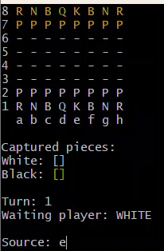
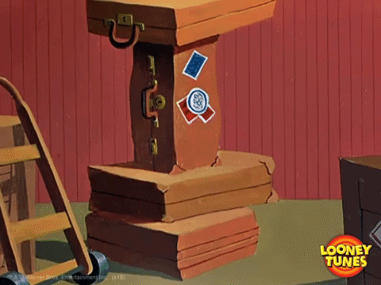
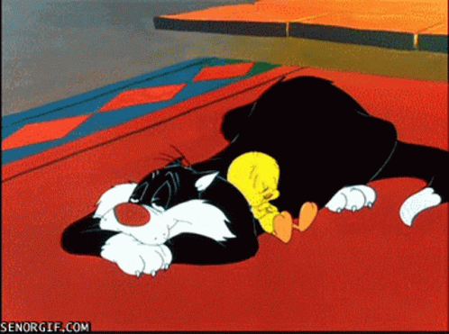
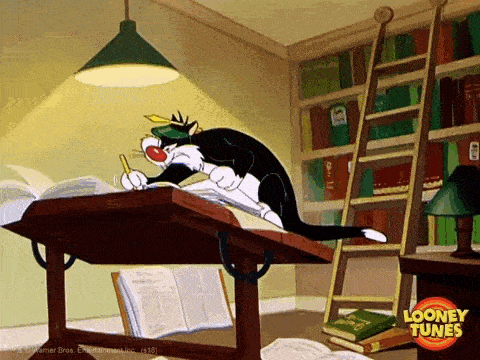

<h1 align="center">♟️ Chess System ♟️ </h1>

<h3 align="center">Um sistema de jogo de xadrez</h3>

<p align="center">
  
</p>


A aplicação foi criada utilizando apenas os príncipios da Orientação a Objetos da Linguagem Java, incluindo Programação Funcional e Expressões Lambda.

Foram implementadas as jogadas especiais: En Passant e Roque, como também a Promoção das Peças.


### ⚙️ Tecnologias Utilizadas 

<p align="left">
  
</p>

Linguagens, ferramentas e bibliotecas utilizadas para elaborar o projeto.

* [Java 17](https://www.oracle.com/java/technologies/javase/jdk17-archive-downloads.htmlo)
* [Eclipse](https://www.eclipse.org/downloads/)
* [Terminal GitBash](https://git-scm.com/downloads)

##  🪄 Como rodar o projeto

<p align="left">
  
</p>

Com o apoio da sua IDE escolhida faça o download do projeto aqui no git, na opção: **<>code**.

Importe o projeto em:

```
File > Import > General > Existing Projects into Workspace > [Pasta com projeto local] > chess-system > finish
```

Localize a pasta local do projeto no seu computador e abra a pasta bin:

```
chess-system > bin >  Abrir no Terminal (Lado direito do mouse)
```

Depois, digite o seguinte comando no terminal para iniciar a aplicação:

```
 > java application/Program
```

É normal cada terminal ter suas cores características, o terminal utilizado do GitBash oferece uma opção variada de cores para tornar a interface de peças inimigas mais diferenciável.

Você pode escolher um que melhor atenda as suas necessidades, desde que tenha integração aos menus do Explorador de Arquivos.

## ⏭️ Próximos passos

<p align="left">
  
</p>

Futuramente, o projeto terá uma interface visual front-end.